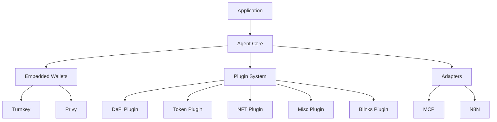

# Solana Agent Kit v2

## Overview

Solana Agent Kit is an open-source toolkit designed to streamline the creation of Solana-powered applications with integrated wallet and transaction capabilities. Version 2 represents a complete evolution of our toolkit, providing developers with a more modular, plug-and-play experience with embedded wallet support.

With over 100,000 downloads, 1,400+ stars, and 800+ forks, Solana Agent Kit v1 saw tremendous adoption among developers but faced two major challenges:
- Input private key method that wasn't 100% secure
- Increasing tooling context and LLM hallucinations due to 100+ aggregate tools

Version 2 directly addresses these issues with a completely redesigned architecture that improves security, reduces hallucinations, and enhances developer experience.

## Key Features of v2

<CardGroup cols={2}>
  <Card title="Embedded Wallet Support" icon="wallet">
    Secure wallet integration with support for Embedded wallets like Turnkey and Privy for enhanced security and human-in-the-loop confirmation.
  </Card>
  <Card title="Plugin Architecture" icon="puzzle-piece">
    Modular plugins that reduce hallucinations and context bloat by allowing agents to call only relevant tools for specific tasks.
  </Card>
  <Card title="React Native Support" icon="mobile-screen">
    Mobile-friendly development with a React Native support and out of the box examples
  </Card>
  <Card title="Improved Evals & Benchmarks" icon="chart-line">
    LangChain evals for most tools, significantly increasing the performance of prompts passed to the agent kit.
  </Card>
</CardGroup>

## Plugin Ecosystem

Solana Agent Kit v2 introduces a powerful plugin system that lets you install only what you need:

- **Token Plugin** (`@solana-agent-kit/plugin-token`): Transfer assets, swap tokens, bridge assets, and perform rug checks
- **NFT Plugin** (`@solana-agent-kit/plugin-nft`): Mint, list, and manage Metaplex NFT metadata
- **DeFi Plugin** (`@solana-agent-kit/plugin-defi`): Stake, lend, borrow, and trade on spot and perpetual markets
- **Misc Plugin** (`@solana-agent-kit/plugin-misc`): Request airdrops, access price feeds, get token information, and register domains
- **Blinks Plugin** (`@solana-agent-kit/plugin-blinks`): Interact with arcade games and other Solana protocol blinks

## Core Architecture

Solana Agent Kit v2 is built around a modular, plugin-based architecture:

The architecture delivers significant improvements:

- **Reduced Hallucinations**: By limiting LLM exposure to only relevant tools
- **Enhanced Security**: Private keys never need to be directly input
- **Human-in-the-loop**: Optional transaction confirmation through Privy integration
- **Fine-grained Rules**: Advanced control through Turnkey integration
- **Better Performance**: Improved prompts and comprehensive evaluations

## Getting Started

Check out the [Quick Start Guide](docs/v2/setup/quickstart) for more detailed setup instructions and to create your first agent-powered application in minutes.

For complete working examples, see our [implementation examples](/docs/v2/examples/embedded-wallets/privy) that demonstrate the Agent Kit in action.

## Key Integrations

Solana Agent Kit v2 integrates with powerful tools to enhance your applications:

- **[Turnkey](https://turnkey.com)**: Implement fine-grained rules for your autonomous agent, enhancing security
- **[Privy](https://privy.io)**: Enable human-in-the-loop functionality where the agent waits for transaction confirmation
- **[LangChain](https://langchain.com)**: Leverage comprehensive evals to ensure optimal prompt performance

## Community and Support

Join our growing community of developers building with Solana Agent Kit:

- [GitHub Repository](https://github.com/sendaifun/solana-agent-kit)
